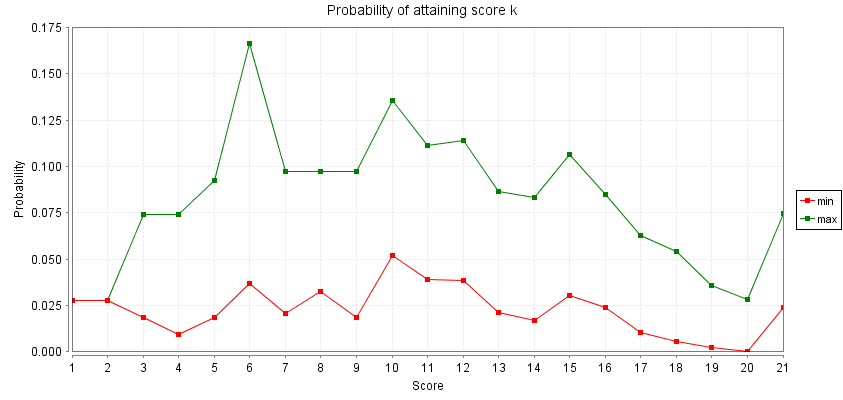
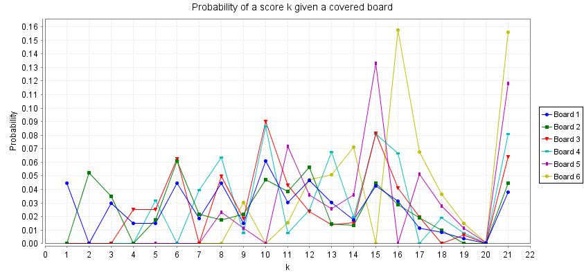
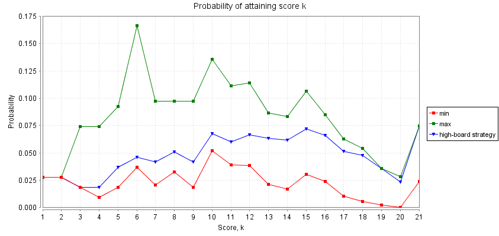
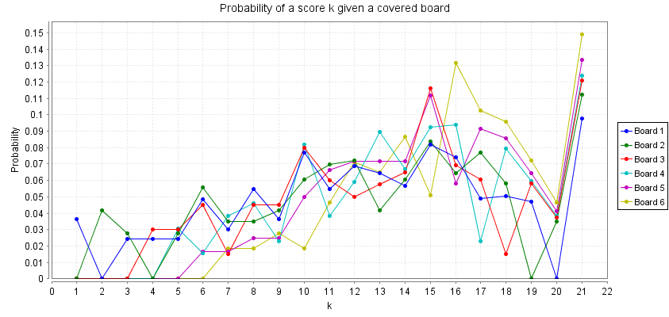
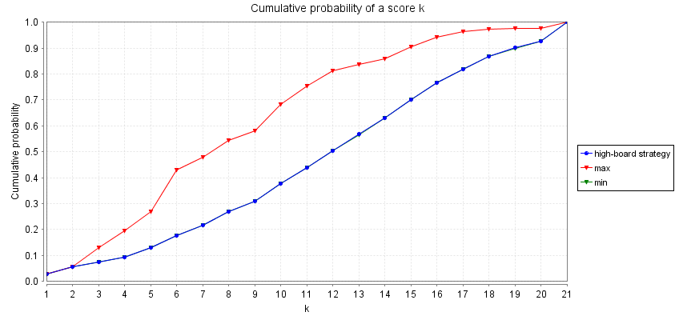

# Shut The Box (6 boards + d6)

## Why did I develop this model?

I owned a copy of a game called Shut the Box, which I thought would be an interesting stochastic game to study for various reasons:

* It's relatively simple to model, since it's a one-player game and the number of states is relatively small.
* The game has various different strategies which are relatively easy for players to derive and use with some experience in the game.
* The game has a number of parameters (such as the number of boards and the probability distribution of the dice), which I could vary to examine how the game changes as a result.

While the game is typically played with 9-12 boards using 2d6, the number of boards adds significant complexity to the model - in particular, the number of choices of which boards to cover for each die value is given by the number of integer partitions of `n` into distinct parts (since each number can be covered at most once), grows [fairly quickly](https://oeis.org/A000009). (note: could reference this result to get "complexity" of model?). 

I decided to create a simplified variant of the game so I could figure out which aspects should be pre-processed, and also get an idea for some interesting properties to consider using an example that was small enough to analyse intuitively. I chose to use 6 boards because it corresponds nicely with a single die, and because it includes an example of covering 3 boards (if a 6 is rolled and boards 1, 2 and 3 are covered).

## Initial model

My initial model for Shut The Box with 6 boards and a d6 (hence known as STB6) is inherently nondeterministic, since we don't express any preference on which boards should be covered at each step (so long as this choice is valid).

The hardest part of model development was getting all the conditions right for deciding which boards to cover (especially for the cases where no valid choices existed, keeping track of multiple applications of De Morgan's laws). This is a good sign, since this step can be automated relatively easily.

## Initial properties

Several properties were checked, described below in more detail. Note that since our model is deterministic, the notion of probability [slightly differs](https://www.prismmodelchecker.org/manual/PropertySpecification/ThePOperator) - rather, we consider the probability the proposition is satisfied *for all resolutions of nondeterminism*. So in these cases we consider a min and max probability.

### Termination

The game always terminates by construction, since after every dice roll we either cover some boards or terminate.

### Expected score

The minimum expected score was approximately 8.643, while the maximum was approximately 12.149 - about a 4 point difference overall. This isn't massive, but it does represent a significant difference based on strategy.

### Probability of a score k

The probability of attaining a particular score k, from 1 to 21, is shown on the following graph:

This graph contains several interesting points:

* We can view the difference between the minimum and maximum score as a measure of the influence of strategy in attaining that score. For instance, scoring 1 or 2 requires a very specific series of dice rolls (either consecutive 1s or consecutive 2s respectively), and no strategy can prevent this.
* The "plateau" around 17 to 20 shows a similar phenomenon, since very few possible sets of covered boards get these scores (e.g to get a 20, you need to cover everything except 1). While strategy *can* help you get to 20 without prematurely losing, when you reach 20 it's purely down to luck whether or not you roll a 1.
* The gap increases considerably on 21 (the "perfect" score), suggesting that sound strategy can have a strong impact on the game.
* Of particular interest are the peaks at 6, 10 and 15 respectively. These are triangular numbers, and the gap in strategy is especially wide here. For instance, if the player start a new game, rolls a 6 and decides to cover the 6, this leaves every option open, and they're guaranteed to have another valid move. But if they cover 1, 2 and 3 instead, this gives them a 50% chance to lose next turn. Hence, bad strategies can drastically increase the probability of being stuck on these points. (Of course, a sequence of low rolls can lead to these points as well, hence the smaller spike in minimum probability as well).

Note that "maximum" does not necessarily mean "optimal". Indeed, we expect that for low scores the maximum probability represents the *worst* strategy, while at high scores it represents the *best* strategy. So we expect that any optimal strategy will start close to the minimum probability, and end up close to the maximum probability.

### Expected number of dice rolls

The minimum expected roll count is approximately 3.178 while the maximum expected roll count is approximately 4.314. This is broadly proportional to the difference in minimum and maximum expected score, which suggests a fairly natural correlation between the number of rolls and score as expected. One way to interpret this is that the values of the die don't make much difference to the overall result of the game - it's the board covering strategy that makes the main difference.

### Expected score given a particular board is covered

I then considered a conditional probability of receiving a particular score, given that we know a particular board is covered. The results are shown on this somewhat messy graph (n.b facet this if I use this in the dissertation):

What we can see here is that small board values are common but don't have much correlation to the final score, whereas large values are rarer but are much more reliable indicators of high scores.

## Developing a strategy

From these results, I hypothesised that a good strategy for the game should prioritise covering the highest available numbers first, since these numbers are strong indicators of high scores, while choosing too many lower numbers early on can lead to a premature end. I developed this strategy in a separate model (which we refer to as the "high-board" strategy), which is now deterministic since we have clearly defined preferences for which set of boards we should cover at each step, giving the following results:

### Expected score

The expected score of the game under the high-board strategy is approximately 12.149, which corresponds with the maximum expected value with no defined strategy. This suggests that the high-board strategy is actually an optimal strategy for Shut the Box.

### Probability of a score k

Adding the high-board strategy to the previous graph gives:

We note this corresponds precisely to the prediction we made earlier, that an optimal strategy will start close to the minimum probability and converge to the maximum probability. Indeed, further examination of the data shows that the maximum probability and the probability under the high-board strategy of scoring 21 are equal, at least up to numerical convergence. We also note that the previous peaks at triangular numbers exist, but especially at a score of 6 they're noticeably smaller than the minimum and maximum probability peaks.

### Expected dice rolls

Under the high-board strategy, the expected number of dice rolls is approximately 4.314 - and again, this corresponds precisely with the maximum expected number of dice rolls with no strategy. This should be expected, since the probability distribution of the die is the unchanged between both strategies.

### Expected score given a particular board is covered

Using the high-board strategy, our previous messy graph becomes:

Here there's more of a correlation between the board and the score for all boards, though it's still strongest for higher board values as expected.

### Cumulative probability of a score k

Finally, we show a cumulative probability of getting a particular score, for the high-board strategy and for the minimum and maximum probabilities with the nondeterministic model:

Note that unlike our previous graphs, here the "minimum" and "maxmimum" cumulative probabilities represent the optimal and suboptimal strategies respectively. And in this case, the graph shows that the high-board strategy is indeed the optimal strategy for Shut the Box.

## Next steps

Initial analysis is encouraging: A clear optimal strategy has been shown, which could be used to show why Shut the Box is a "bad" game (since it's really easy to optimise). My next steps should be:

* Develop preprocessing tools to automate the creation of larger models
* Look more into automation, particularly when running experiments (perhaps with Jupyter notebooks? they support running terminal commands by default)
* Longer term goal: look into nicer methods of visualisation (the graphs from PRISM are acceptable but not great - matplotlib might be a better idea? And it works well with Jupyter notebooks)

* Investigate whether the high-board strategy is still optimal for larger models (does it differ with a non-uniform probability distribution?)
* Investigate the triangular numbers phenomenon (this should be easier with 12 boards since there's more triangular numbers available)
